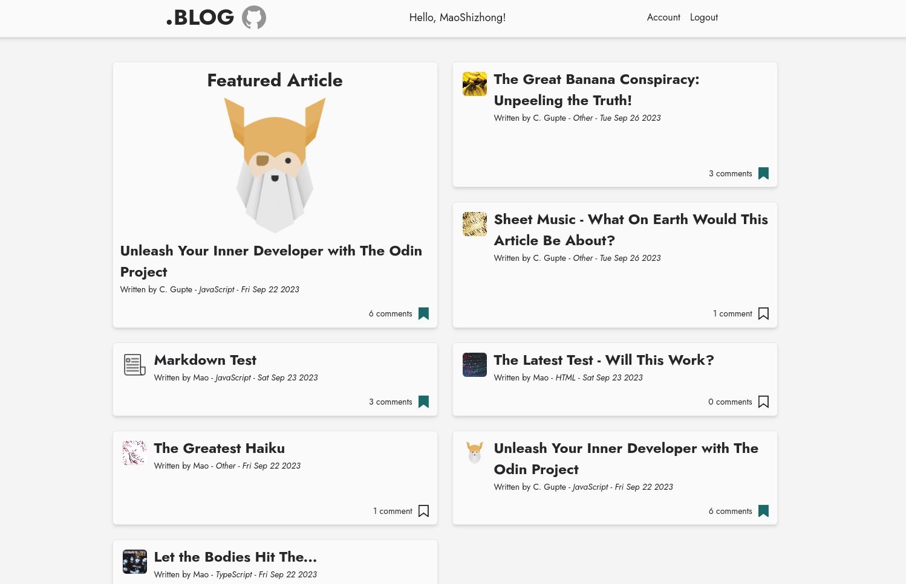

# Blog API

## Repos

Main client: [Repo](https://github.com/MaoShizhong/blog-frontend-reader) | [Live](https://dotblog.netlify.app/)

CMS: [Repo](https://github.com/MaoShizhong/blog-frontend-author) | [Live](https://dotblog-cms.netlify.app/)

## API Built using

-   Node/Express w/ TypeScript
-   jsonwebtoken
-   MongoDB/Mongoose
-   Express validator
-   Deployed via Adaptable

 
